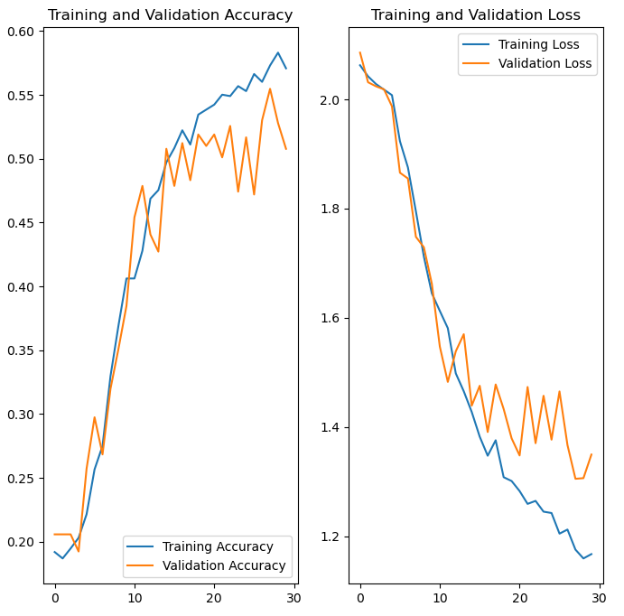
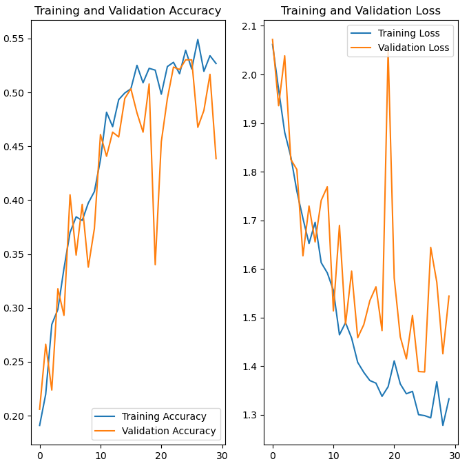
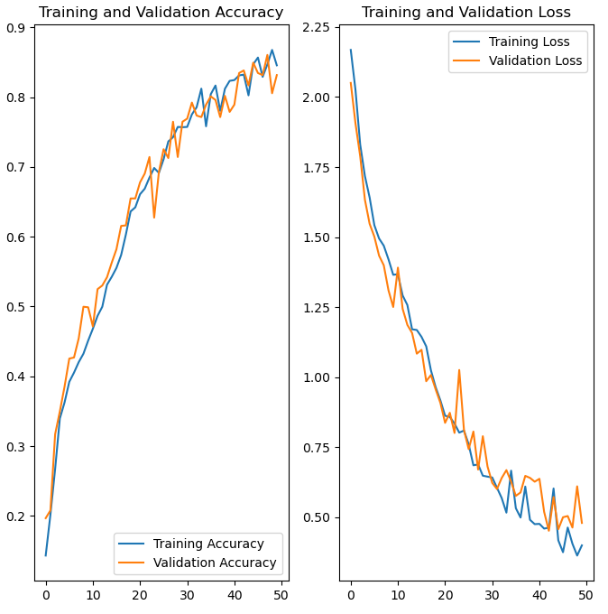

# Melanoma Detection Using Custom CNN

This project leverages a custom Convolutional Neural Network (CNN) to detect melanoma and classify skin lesions across 9 distinct classes. Additionally, the **Gradio** library has been used to create an interactive web application for real-time model predictions. The model achieves an **83% accuracy** in classifying skin lesions.

## Table of Contents
- [General Information](#general-information)
- [Algorithms Used](#algorithms-used)
- [Dataset Information](#dataset-information)
- [Steps Involved](#steps-involved)
- [Results](#results)
  - [Baseline Model](#baseline-model)
  - [Augmented Model](#augmented-model)
  - [Final Model](#final-model)
- [Conclusion](#conclusion)
- [Technologies Used](#technologies-used)
- [Contact](#contact)
- [License](#license)

## General Information

This project aims to address the challenge of classifying various skin lesions, including melanoma, using deep learning techniques. A **custom CNN architecture** was developed to solve this problem. Additionally, the project addresses issues like **class imbalance** by employing data augmentation strategies and other preprocessing techniques. The final model is deployed as a simple, user-friendly web interface using **Gradio**.

## Algorithms Used
- **Convolutional Neural Network (CNN)**: A deep learning architecture specifically designed for feature extraction and classification of skin lesion images.

## Dataset Information

The dataset used contains **2239 images** of both malignant and benign skin conditions, sourced from the **International Skin Imaging Collaboration (ISIC)**. The dataset covers the following skin diseases:

- Actinic keratosis
- Basal cell carcinoma
- Dermatofibroma
- Melanoma
- Nevus
- Pigmented benign keratosis
- Seborrheic keratosis
- Squamous cell carcinoma
- Vascular lesion

The dataset is moderately imbalanced, with a larger number of **melanoma** and **mole (nevus)** images compared to other categories.

## Steps Involved

1. **Data Loading**: Load and preprocess the dataset.
2. **Baseline Model Building**: Develop an initial CNN model.
3. **Training and Testing the Baseline Model**: Train and evaluate the baseline model on the dataset.
4. **Building an Augmented Model**: Apply data augmentation techniques to improve generalization.
5. **Training and Testing the Augmented Model**: Train and test the augmented model.
6. **Countering Class Imbalance**: Use **Augmentor** to balance class distribution through targeted augmentation.
7. **Building the Final Model**: Construct the final, improved model incorporating augmentation and other refinements.
8. **Training and Testing the Final Model**: Train and validate the final model on the dataset.
9. **Verifying the Model**: Ensure robust performance on unseen data and evaluate accuracy.

## Results

### Baseline Model
- The baseline model provided initial insights into the performance with no data augmentation.
-  <!-- Replace with actual image path -->

### Augmented Model
- After applying data augmentation, the model demonstrated improved generalization and robustness.
-  <!-- Replace with actual image path -->

### Final Model
- The final model, after handling class imbalance and other enhancements, achieved **83% accuracy** and a **loss of 0.5**.
-  <!-- Replace with actual image path -->

## Conclusion
The model's performance improved significantly as **accuracy increased** while **loss consistently decreased**. The final model achieved **83% validation accuracy** with a **validation loss of 0.5**. The implementation of data augmentation and techniques to counter class imbalance played a key role in enhancing the model's performance, making it highly effective at predicting the class of skin lesions with considerable accuracy.

## Technologies Used
- **Python**
- **TensorFlow**
- **Keras**
- **Augmentor**
- **Matplotlib**
- **NumPy**
- **Gradio** (for web application interface)

## Contact
Created by [@sanchitapatil](https://github.com/sanchitapatil) - feel free to reach out for any questions or collaboration opportunities!

## License
This project is open-source and available under the [MIT License](LICENSE).
